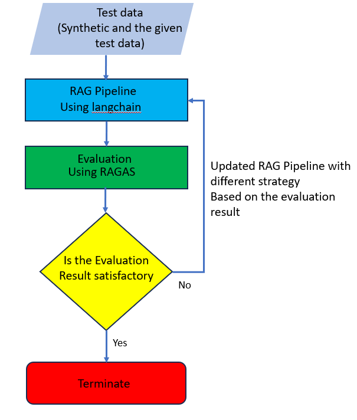

# Contract-Advisor-RAG
Towards Building A High-Precision Legal Expert LLM APP
# Business objective  

Lizzy AI is an early-stage Israeli startup, developing the next-generation contract AI (see short video). We leverage Hybrid LLM technology (edge, private cloud and LLM services), to build the first, fully autonomous, artificial contract lawyer. The first step in our journey is a powerful contract assistant, with the ultimate goal of developing a fully autonomous contract bot, capable of drafting, reviewing, and negotiating contracts, independently, end-to-end, without human assistance. 

Our task is as follows:  build, evaluate and improve a RAG system for Contract Q&A (chatting with a contract and asking questions about the contract). 

The business objective is to build a question-answering contract bot that uses a Retrieval-Augmented Generation (RAG) system. The goal is to create the best possible RAG system with the most effective strategies to provide users with the most relevant information about contracts.
To evaluate the RAG pipeline, I am using two different test datasets:
•	A synthetic dataset generated by the RAGAS tool.
•	A manually curated test dataset.
By evaluating the RAG pipeline's performance on these two datasets, I can assess the effectiveness of the current RAG strategies. Based on the evaluation results, I will then update and refine the RAG strategies to improve the bot's question-answering capabilities.
The overall workflow is to use the RAGS evaluation to assess the RAG pipeline, and then iterate on the RAG strategies based on the evaluation findings to continuously enhance the question-answering contract bot.

There are two basic variables that affect the performance of the RAG pipeline. These are:
•	User query
•	Retrieved data (Context)
•	LLM 
Therefore, by modifying these variables I can improve the RAG performance.
RAGAS evaluation metrics
Faithfulness: This measures the factual consistency of the generated answer against the given context. It is calculated from answer and retrieved context. The answer is scaled to (0,1) range. Higher the better.
Answer Relevancy: The evaluation metric, Answer Relevancy, focuses on assessing how pertinent the generated answer is to the given prompt. A lower score is assigned to answers that are incomplete or contain redundant information and higher scores indicate better relevancy.
Context recall: Context recall measures the extent to which the retrieved context aligns with the annotated answer, treated as the ground truth. It is computed based on the ground truth and the retrieved context, and the values range between 0 and 1, with higher values indicating better performance.
Context precision: Context Precision is a metric that evaluates whether all of the ground-truth relevant items present in the contexts are ranked higher or not.
Based on the metrics I have evaluated; I can determine which strategies to modify in order to improve the overall performance. 
